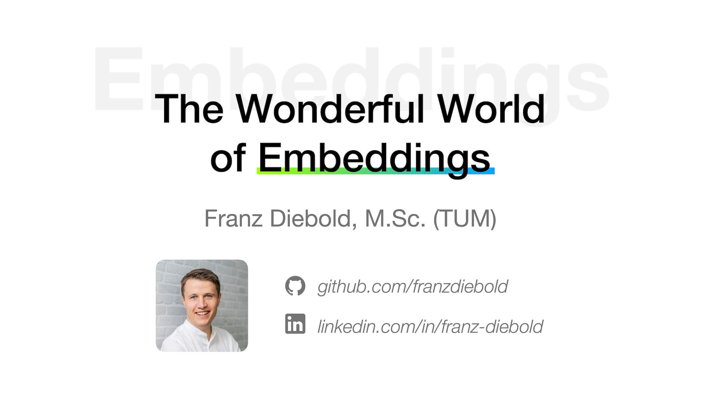

# Embeddings Talk "The Wonderful World of Embeddings"

Duration: ~ 1 hour

## Talk held
- on Nov. 20th 2019 at Syskron X ([Meetup](https://www.meetup.com/de-DE/Industrieverein-Bayern-angewandte-Kuenstliche-Intelligenz/events/266105969/))
- on Dec. 12th 2019 at TIKI (Weiden)

## Usage
You need to unzip the GloVe embedding file: `resources/glove.6B.50d.txt`
